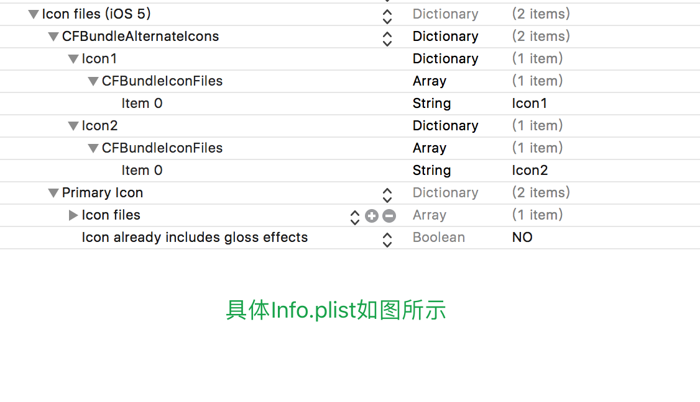

# iOSDynamicChangeIcon
iOS开发中,动态更改APP图标

iOS 10.3 加入了了更换应用图标的新功能，开发者可以为应用提供多个应用图标选择。用户可以自由的在这些图标之间切换，下面具体查看切换步骤。
实现方法:

1.先把你需要的所有图片都导入项目中（比例为1:1）

2.plist文件配置，添加Icon files (ios 5)类型为Dictionary
点开Icon files (iOS 5)，里面有Primary Icon，Newsstand Icon两个key,Primary Icon 里面的图片为AppIcon默认图片。
Icon files (iOS 5)里面创建一个CFBundleAlternateIcons，类型为Dictionary
点击开CFBundleAlternateIcons，添加CFBundleIconFiles,按照如图所示的添加，我添加了三个分别是 Icon1，Icon2（这个名字是自己写的），它们对应的本地图片名字是Icon1,Icon2,添加时数据类型对应一致就OK.

3.执行代码

~~~
- (IBAction)setIconClick:(UIButton *)sender {
    [self setIconName:nil];//nil表示换回原始Icon
}

- (IBAction)setIcon1Click:(id)sender {
    [self setIconName:@"Icon1"];
}

- (IBAction)setIcon2Click:(id)sender {
    [self setIconName:@"Icon2"];
}

- (void)setIconName:(NSString *)name {
UIApplication *application = [UIApplication sharedApplication];
//先判断设备支不支持“AlternateIcons”
if ([application supportsAlternateIcons]) {
//这里的IconName必须在Info.plist里定义，具体格式看Info.plist
    [application setAlternateIconName:name completionHandler:^(NSError * _Nullable error) {
    if (error) {
        NSLog(@"error => %@", error.localizedDescription);
    } else {
        NSLog(@"done!");
    }
  }];
}
}
~~~
